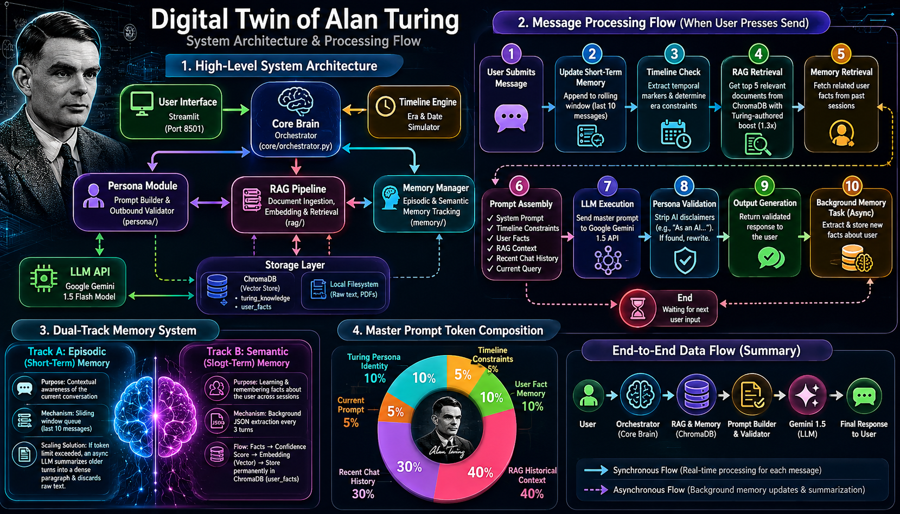

# 🧠 Digital Twin of Alan Turing

An interactive AI application that precisely embodies the knowledge, reasoning style, and personality of Alan Mathison Turing. Built as an advanced demonstration of Retrieval-Augmented Generation (RAG), persistent long-term memory, and persona-driven prompt engineering.


---

## 🌟 Core Features

- **Unbreakable Persona Emulation**: Advanced prompt engineering deeply captures Turing's unique voice—scholarly, occasionally hesitant, deeply analytical, and unapologetically visionary. The agent is strictly prompted to never break character or admit to being a digital construct.
- **RAG Knowledge Base**: Turing's responses are dynamically grounded in his actual writings. The system uses a vector database containing chunked text from his seminal papers (*On Computable Numbers*, *The Chemical Basis of Morphogenesis*), his historical letters, and comprehensively scraped Wikipedia encyclopedic data.
- **Dual Memory System**:
  - *Short-term (Episodic)*: Tracks the immediate context of the current conversation session using a rolling window.
  - *Long-term (Semantic)*: Automatically extracts facts about the user during conversation and persists them in a secondary vector space, allowing the Twin to "remember" you across multiple different sessions.
- **Dynamic Memory Dashboard**: A visual metrics dashboard built natively in Streamlit, showing exactly what the Digital Twin has "learned" about the user over time, exposing the inner workings of the long-term memory system.
- **Timeline Engine**: Imbues the Twin with awareness of his historical context. If you ask a question "as if it's 1940", the engine instructs the LLM to restrict its knowledge strictly to events before that era.

---

## 🏗️ System Architecture & Approach in Detail

The application is built entirely in Python, orchestrated by a central pipeline that manages context layering before calling the LLM. It relies on a multi-agent architectural pattern where sub-components independently handle memory extraction, historical contextualization, and persona validation.



### 1. The Persona & Prompt Engineering (`persona/`)
To achieve an "unbreakable" persona, the system does not simply ask the LLM to "act like Alan Turing." It builds a comprehensive **Master Prompt** per turn. 
- **System Prompt**: Defines Turing's core identity, speaking style (British English, scholarly, slightly hesitant), and psychological traits. It expressly forbids the model from admitting it is an AI, an emulation, or a digital twin.
- **Contextual Injection**: The prompt is dynamically appended with the retrieved RAG context, recent episodic memory, semantic facts about the user, and the timeline context.
- **Validator**: An outbound validation layer (`PersonaValidator`) checks the LLM's response for AI disclaimers (e.g., "As an AI model...") and automatically strips them before the user sees the output.

### 2. The Dual-Track Memory Manager (`memory/`)
The memory system is designed to simulate human recollection, operating on two asynchronous tracks:
- **Episodic (Short-Term) Memory**: A sliding window queue that maintains the last `N` messages of the current session. If the conversation runs long, an LLM summarization task compresses older turns into a dense summary, maintaining context while saving token limits.
- **Semantic (Long-Term) Memory**: A background LLM process runs continuously, analyzing every exchange for personal facts about the user (e.g., "The user is 16 years old," "The user is a cryptography student"). If a fact is detected, it is extracted as JSON, embedded via `all-MiniLM-L6-v2`, and stored in a separate ChromaDB collection (`user_facts`). On subsequent turns—even across entirely new sessions—the Retriever queries this database to proactively inject past memories into Turing's prompt, allowing him to "remember" you.

### 3. The Retrieval-Augmented Generation (RAG) Pipeline (`rag/`)
To ensure Turing's responses are historically accurate and grounded in his actual work, the system uses a sophisticated RAG architecture:
- **Ingestion & Scraper**: The system programmatically scrapes Wikipedia via the `scrape_sources.py` script for biographical and historical context (Bletchley Park, Enigma, ACE). It also ingests raw `.txt` versions of Turing's primary papers and letters.
- **Chunking & Embedding**: Documents are split using a `TextChunker` (512-token chunks with 50-token overlap) to preserve semantic boundaries. They are then embedded using the `all-MiniLM-L6-v2` transformer and stored in a ChromaDB vector store.
- **Retrieval Engine**: When the user asks a question, the `Retriever` queries ChromaDB using cosine similarity, fetching the top-k most relevant chunks to ground the LLM's response. Primary source documents (Turing's own writings) are given a multiplicative boost to prioritize his actual voice over encyclopedic summaries.

### 4. The Timeline Engine (`timeline/`)
To imbue the Twin with a sense of historical placement, the `TimelineEngine` parses the user's input for temporal markers (e.g., "What are you working on in 1941?"). 
- If a specific year is detected, the Engine instructs the RAG retriever to *only* pull documents from that year or earlier.
- It also injects a prompt directive forcing the LLM to restrict its world knowledge to that specific era.
- If the user asks about post-1954 (Turing's death) technologies like modern smartphones, the Engine detects a "post-death topic" and forces the LLM to speculate conceptually based on his 1950s theories of computation, rather than breaking character.

### 5. The Orchestrator (`core/orchestrator.py`)
The Orchestrator acts as the "brain," performing the synchronous workflow for every message:
1. Intercepts the user's message.
2. Calls the **Timeline Engine** to detect era constraints.
3. Calls the **RAG Retriever** to fetch historical knowledge.
4. Calls the **Memory Manager** to fetch semantic user facts and episodic history.
5. Compiles the **Master Prompt**.
6. Calls the **Google Gemini 1.5** API to generate the response.
7. Post-processes the response via the **Persona Validator**.
8. Returns the response to the Streamlit UI.
9. Asynchronously fires background jobs to extract new long-term facts for future use.

---

## 🚀 Getting Started

### Prerequisites

- Python 3.10+
- A Google Gemini API Key (`GEMINI_API_KEY`)

### Installation

1. Clone the repository
2. Install dependencies:
   ```bash
   pip install -r requirements.txt
   ```
3. Set up your environment variables:
   Copy `.env.example` to `.env` and add your Gemini API key.
   ```bash
   cp .env.example .env
   ```

### Data Ingestion

Before running the application, you must populate the RAG knowledge base. 
First, run the automated scraper to fetch Wikipedia articles and save them to `data/raw/papers`:

```bash
python scripts/scrape_sources.py
```

Then, run the ingestion script to chunk the text files, generate embeddings, and store them into the ChromaDB vector database:

```bash
python scripts/ingest_documents.py
```

### Running the App

Start the Streamlit interface:

```bash
streamlit run streamlit_app.py --server.port 8501
```
Then navigate to `http://localhost:8501` in your browser.

---

## 🧪 Testing

The codebase includes an extensive test suite verifying RAG retrieval accuracy, memory extraction, and persona consistency.

Run the test suite using pytest:

```bash
python -m pytest tests/
```

## 📜 License
MIT License
